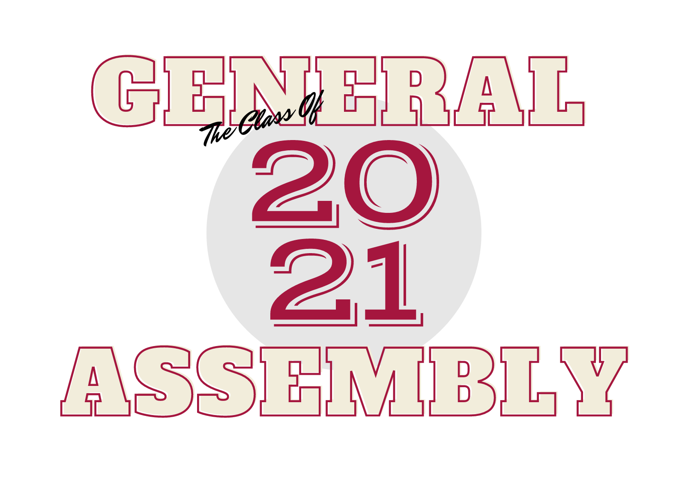

# 
Sign My Yearbook

#### 
https://sign-my-yearbook.netlify.app/

a href="https://sign-my-yearbook.netlify.app/">test</a>

 

### I've created an application for my fellow software engineering graduates to digital "sign my yearbook"
 
 classmates will be able to add a photo and sign my digital yearbook!
 
 
